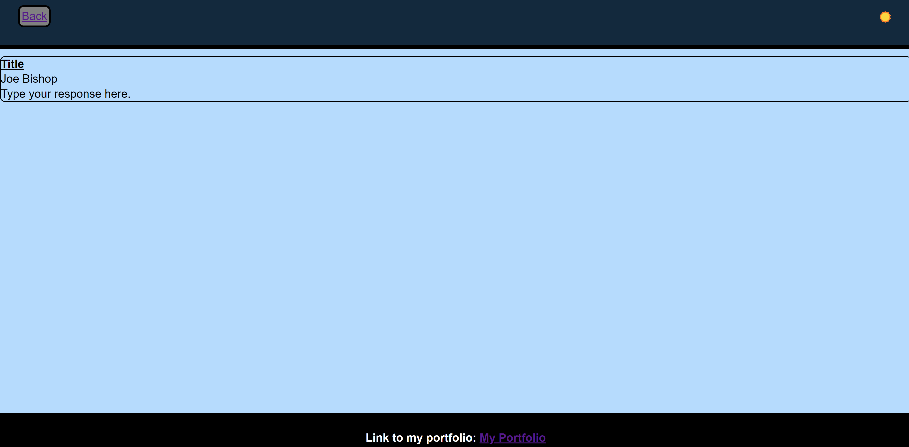

# interactive_blog_post

## Description
First attempt at creating a blog side that a user can input content and view those inputs. It's purpose was to experiment with using css, as well as linking pages together and storing and using data in local storage. 

## Usage
On the first Page, the user is prompted to put in a Title, the name they would like to go by, and the content of their blog post. Then, after clicking submit, their blog post is displayed on the second page. The user can then press the back button located at the top left of the page, to go back to the original page, and submit another blog post. Each blog post will be displayed on the the second page, in the order submitted. Finally, there is a sun icon that functions as a button to change the page from dark to light mode as the user prefers.

    
    ```md
    
    ```
